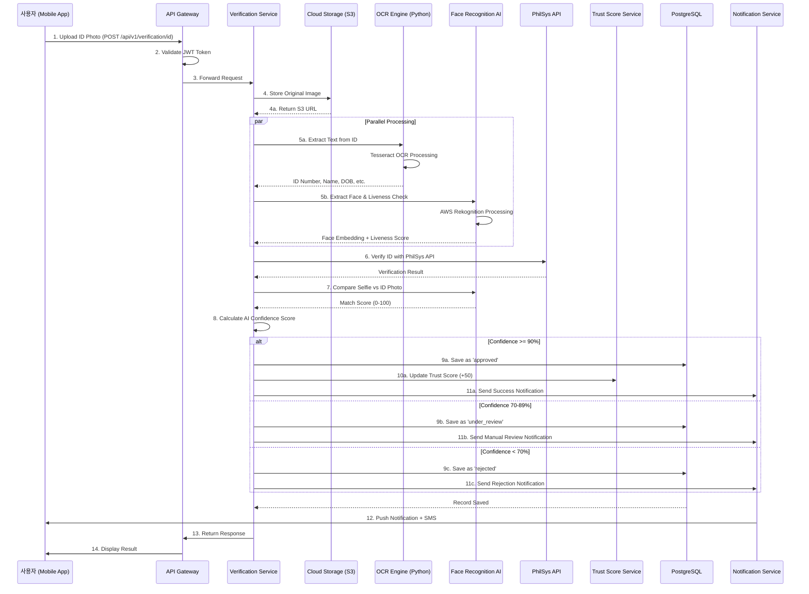
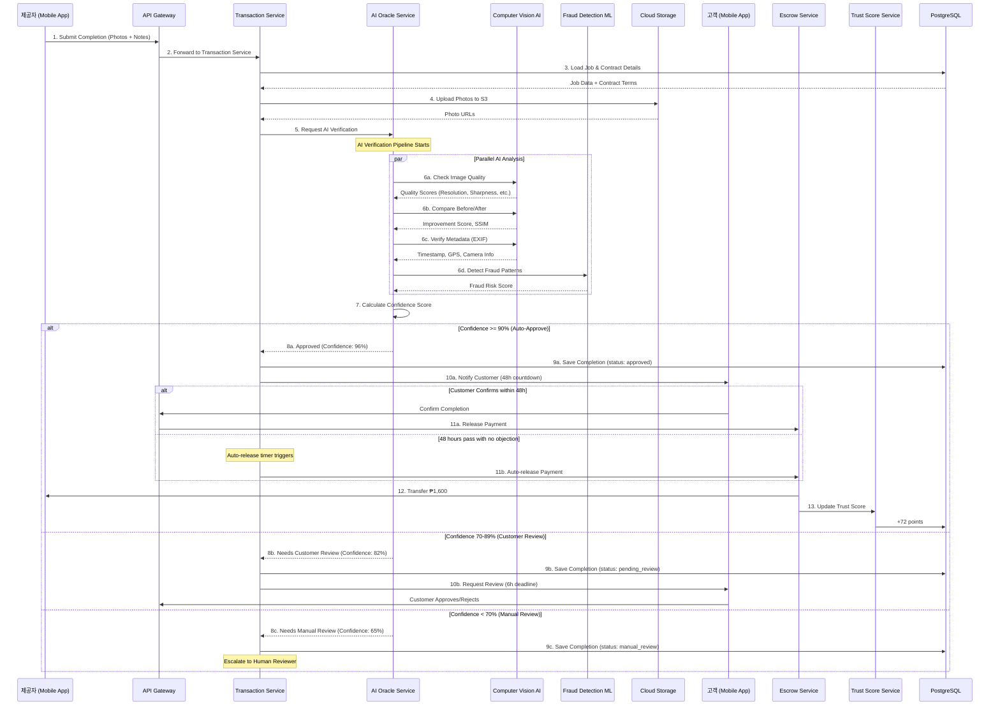
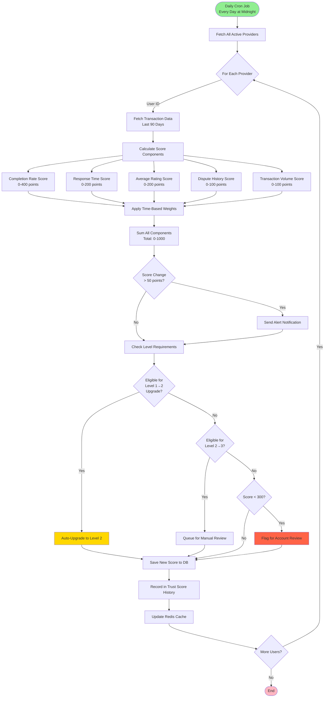
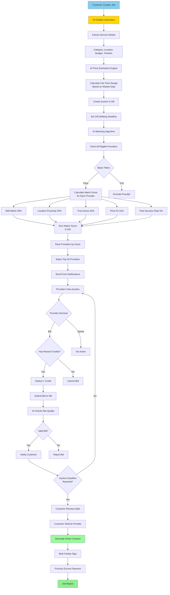
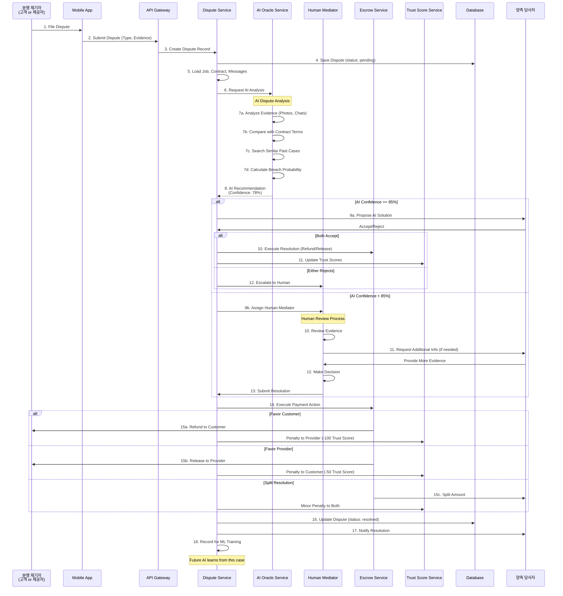
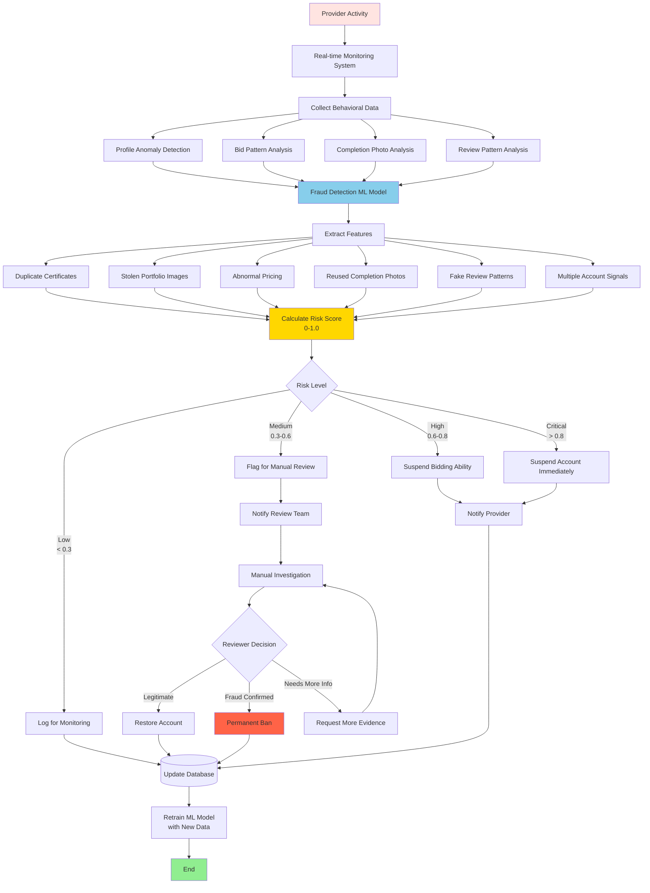
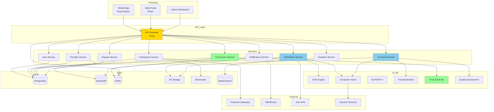

# AI 기반 서비스 제공자 검증 시스템
## Part 3: 데이터 흐름도 (Data Flow Diagrams)

---

## 1. 신분 인증 데이터 흐름

---

## 2. 작업 완료 검증 데이터 흐름

---

## 3. Trust Score 계산 데이터 흐름

---

## 4. 서비스 옥션 매칭 데이터 흐름

---

## 5. 분쟁 해결 데이터 흐름

---

## 6. 실시간 Trust Score 업데이트 흐름

```mermaid
flowchart LR
    Event[거래 이벤트 발생] --> EventType{이벤트 타입}
    
    EventType -->|작업 완료| JobComplete[Job Completed Event]
    EventType -->|리뷰 작성| ReviewPosted[Review Posted Event]
    EventType -->|분쟁 발생| DisputeFiled[Dispute Filed Event]
    EventType -->|분쟁 해결| DisputeResolved[Dispute Resolved Event]
    EventType -->|취소| JobCancelled[Job Cancelled Event]
    
    JobComplete --> Queue[RabbitMQ Event Queue]
    ReviewPosted --> Queue
    DisputeFiled --> Queue
    DisputeResolved --> Queue
    JobCancelled --> Queue
    
    Queue --> TSWorker[Trust Score Worker<br/>Node.js Service]
    
    TSWorker --> FetchUser[Fetch User Current Score]
    FetchUser --> CalcDelta[Calculate Score Change]
    
    CalcDelta --> UpdateDB[(Update PostgreSQL)]
    UpdateDB --> UpdateCache[(Update Redis Cache)]
    
    UpdateCache --> CheckThreshold{Score Change<br/>> 50 points?}
    
    CheckThreshold -->|Yes| SendNotif[Send Notification]
    CheckThreshold -->|No| LogHistory[Log to History Table]
    
    SendNotif --> LogHistory
    LogHistory --> CheckMilestone{Milestone Reached?}
    
    CheckMilestone -->|Level Up| AwardBonus[Award Bonus Credits]
    CheckMilestone -->|Warning Threshold| SendWarning[Send Warning]
    CheckMilestone -->|No| Done[Done]
    
    AwardBonus --> Done
    SendWarning --> Done
    
    style Event fill:#FFE4B5
    style Queue fill:#87CEEB
    style Done fill:#90EE90
```

---

## 7. 사기 탐지 데이터 파이프라인

---

## 8. 전체 시스템 컴포넌트 관계도

---

이 문서는 Part 3입니다. 모든 주요 데이터 흐름을 Mermaid 다이어그램으로 시각화했습니다.

추가 문서:
- Part 4: API 명세서
- Part 5: 배포 및 모니터링 가이드

이 다이어그램들은 Markdown을 지원하는 도구(GitHub, GitLab, VS Code, Notion 등)에서 자동으로 렌더링됩니다.
